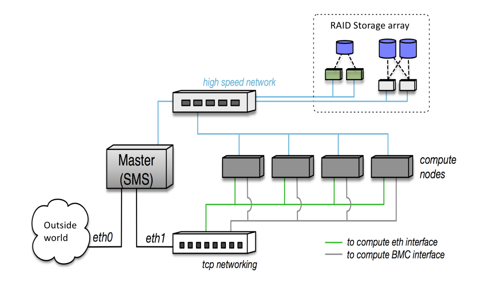

Cluster Architecture
======================

Networking
________________

A cartoon schematic of the cluster networking can be understood below. 

Only the master node can access and is accessible to the outside world. The internal network is divided into two. The first is used for simple interfacing between the compute nodes and the head nodes, including administrative tasks and access to compute node BIOS. The second network is a highspeed fabric managed by Intel OmniPath software. This network is used for multinode jobs. Unfortunately this network is improperly configured at the moment but multimode jobs are still possible through the slower Ethernet networking. 

Software
_______________
From a software point of view, the cluster is configured with help of repositories from OpenHPC, an open source initiative to provide all relevant software for the deployment and maintenance of high performance clusters. For more information visit http://openhpc.community. The headnode and all of the compute nodes run CentOS 7.3 and the compute nodes are provisioned using Warewulf. 

In order to maintain uniformity of all the compute nodes, a virtual version of CentOS is generated on the master node with all relevant libraries and packages installed to this directory. The compute nodes are then fed this virtual image and boot from this everytime they are powered on. This means that any changes to the compute nodes will be erased after a reboot unless the change is made to the image.

All user files and data is stored on an external Redundant Array of Independent Disks (RAID). This allows for large amounts of data to be stored without the possibility of catastrophic loss of data.

An email server is also configured that allows for the cluster to send email alerts regarding the completion of jobs. See the section of how to submit a job for more information. 

